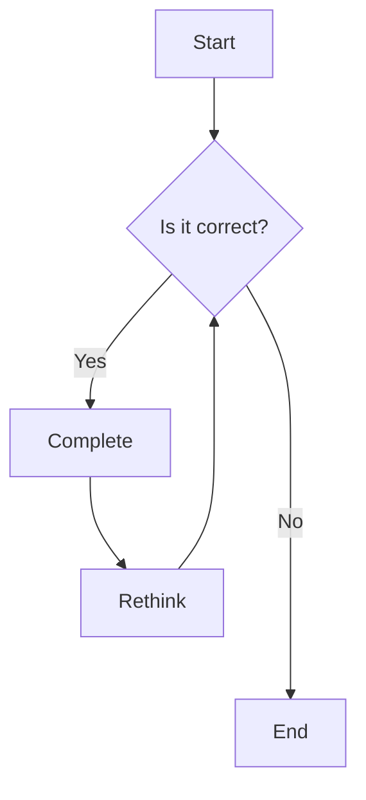

---
title: "Elements"
date: 2008-08-08
category: "Elements"
year: "2008"
image: "images/null.webp"
tag: ["Markdown", "HTML", "Tailwind CSS"]
---

Here is a heading example. You can use these headings according to the following Markdown rules. For example: use `#` for H1 headings, and `######` for H6 headings.

&nbsp;

The recorded voice scratched in the speaker.
The sky was cloudless and of a deep dark blue.
The spectacle before us was indeed sublime.

Whereas recognition of the inherent dignity and of the equal and inalienable rights of all members of the human family is the foundation of freedom, justice and peace in the world, whereas disregard and contempt for human rights have resulted in barbarous acts which have outraged the conscience of mankind, and the advent of a world in which human beings shall enjoy freedom of speech and belief and freedom from fear and want has been proclaimed as the highest aspiration of the common people...

This line of text will become really big!

## Heading 2

### Heading 3

#### Heading 4

----

## Text Emphasis

For italic emphasis, you can use *asterisks* or _underscores_.

For bold emphasis, you can use **asterisks** or **underscores**.

For combined emphasis, you can mix **asterisks with _underscores_**.

Strikethrough uses two tildes. ~~This text has been crossed out.~~

Tooltip: Hover over the dotted underlined text to see supplementary information. When you move your mouse onto the info box, it stays open so you can select the text inside.

----

## Button


<p>


----

## Link

[I am an inline-style link](https://www.google.com)

[I am an inline link with a title](https://www.google.com "Google's Homepage")

[I am a relative reference link to a repository file](../blob/master/LICENSE)

URLs typed directly or enclosed in angle brackets will automatically convert to links.
[http://www.example.com](http://www.example.com) or [http://www.example.com](http://www.example.com). On some platforms (such as GitHub), typing example.com directly will also work.

----

## Paragraph

This is a paragraph of test text. The aesthetic appeal of typography often lies in the visual density of long paragraphs. Unlike the streamlined shape of Western letters, square characters often require slightly larger `line-height` settings (typically recommended between 1.6 and 1.8). The purpose of this text is to help you check paragraph spacing, first-line indentation (if applicable), and text alignment. Whether in dark mode or light mode, the text contrast should always be comfortable. In the age of digital reading, good typography allows readers to look past the layout itself and directly reach the core of the ideas.

----

## Ordered List

1. List item 1: If I were a DJ, would you love me?
2. List item 2: Would you love me? Would you love me?
3. List item 3: Let's sway together, sway and sway
4. List item 4: Let this world have no more worries from now on
5. List item 5: This is list item 555555555555555555555

----

## Unordered List

- List item 001
- List item 002
- List item 003
- List item 004
- List item 005

----

## Checkbox

- [x] **Core Typography Style**: Completed H1 to H6 font scale and margin verification
- [x] **Syntax Highlighting Test**: Dark theme now supported for common programming languages
- [ ] **Mobile Adaptation Optimization**: Horizontal table scrolling on small screens still has minor alignment issues
- [ ] **Interactive Component Debugging**:
    - [x] Tab switching functions normally upon click
    - [ ] Accordion expansion animation needs optimization
- [ ] **SEO & Performance**: Automatic generation of image `alt` attributes and `WebP` format conversion

----

## Notice


This is a standard "note" box.

Ordinary DISCO, we sway ordinarily.



This is a standard "quote" box. Ordinary DISCO, we sway ordinarily.



This is a standard "tip" box. Ordinary DISCO, we sway ordinarily.



This is a standard "info" box. Ordinary DISCO, we sway ordinarily.



This is a warning message.<p>Note: This is a warning message. Note: This is a warning message. Note: This is a warning message. Note: This is a warning message. Note: This is a warning message. Note: This is a warning message. Note: This is a warning message. Note: This is a warning message. Note: This is a warning message. Note: This is a warning message. Note: This is a warning message.


----

## Tab




#### Hey! Hello, I am a tab

This is a block of test content. When users click different tabs, the panel content below switches accordingly. This is ideal for displaying multi-dimensional information within a limited space, such as installation guides for different operating systems.





#### I'd like to talk about typography details

Here is the content for the second tab. Usually, we need to ensure that there is no obvious flickering when switching tabs, and the selected tab should have a clear visual indicator.





#### Here is the third option

You can nest almost any Markdown element inside tabs, including lists, blockquotes, and even code blocks.




----

## Accordions



- It effectively reduces the initial page length.
- Content is expanded only when the user is interested.
- Perfectly suited for FAQ (Frequently Asked Questions) sections.





- You can achieve this using CSS flexbox layout.
- Or adjust it using built-in container class names.





Don't look back don't look back don't look back don't look back don't look back don't look back don't look back don't look back don't look back don't look back don't look back don't look back don't look back don't look back don't look back don't look back don't look back don't look back don't look back don't look back don't look back don't look back don't look back don't look back don't look back don't look back don't look back don't look back don't look back don't look back don't look back don't look back don't look back don't look back don't look back don't look back don't look back don't look back don't look back don't look back don't look back don't look back don't look back don't look back don't look back don't look back don't look back don't look back don't look back don't look back don't look back don't look back don't look back don't look back don't look back don't look back don't look back don't look back don't look back don't look back don't look back don't look back don't look back don't look back don't look back
Don't look back don't look back don't look back don't look back don't look back don't look back don't look back don't look back don't look back don't look back don't look back don't look back don't look back don't look back don't look back don't look back don't look back don't look back don't look back don't look back don't look back don't look back don't look back don't look back don't look back don't look back don't look back don't look back don't look back don't look back don't look back don't look back don't look back don't look back don't look back don't look back don't look back don't look back don't look back don't look back don't look back don't look back don't look back don't look back don't look back don't look back don't look back don't look back don't look back don't look back don't look back don't look back don't look back don't look back don't look back don't look back don't look back don't look back don't look back don't look back don't look back don't look back don't look back don't look back don't look back
Don't look back don't look back don't look back don't look back don't look back don't look back don't look back don't look back don't look back don't look back don't look back don't look back don't look back don't look back don't look back don't look back don't look back don't look back don't look back don't look back don't look back don't look back don't look back don't look back don't look back don't look back don't look back don't look back don't look back don't look back don't look back don't look back don't look back don't look back don't look back don't look back don't look back don't look back don't look back don't look back don't look back don't look back don't look back don't look back don't look back don't look back don't look back don't look back don't look back don't look back don't look back don't look back don't look back don't look back don't look back don't look back don't look back don't look back don't look back don't look back don't look back don't look back



----

## Code and Syntax Highlighting

This is an `Inline code` example.

```javascript
var s = "JavaScript Syntax Highlighting Test";
alert(s);
```

```python
s = "Python Syntax Highlighting Test"
print(s)
```

```c { linenos=true }
#include <stdio.h>

int main(void)
{
    printf("hello, sucka\n");
    return 0;
}
```



----

## Blockquote

> Good typography should be like clear glass. The reader looks straight through it to the ideas without being distracted by the texture of the glass itself. In the flood of digital reading, maintaining a sense of tranquil order is the pursuit of every creator.

----

## Tables

| Header Column | What is this again | What is this |
| ------------- | :-----------: | ----: |
| Column 3 is | Right-aligned | ¥1600 |
| Column 2 is | Center-aligned | ¥12 |
| I don't talk | to people who don't listen to | Forest Swords |

----

## Image


----

## YouTube Video



----

## Custom Video

