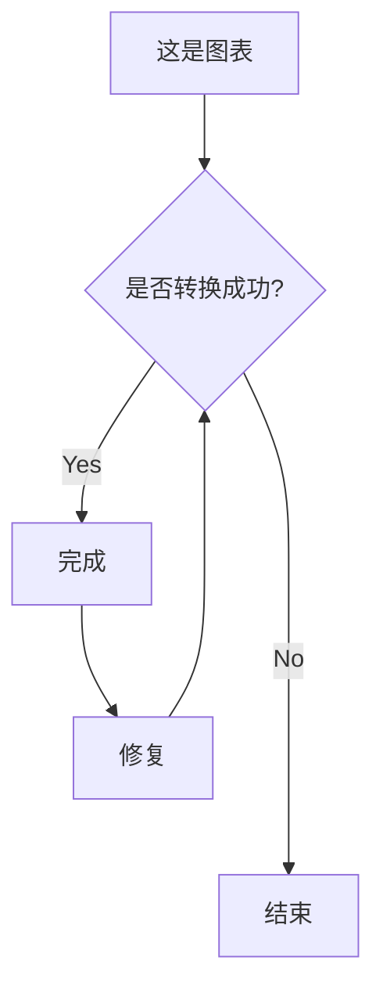

这是第一行，这一行下面还有一行。

这是另起的第二行。

这是第三行，第三行会在块内换一行。  
我是第三个块内的第二行。

<br>

这是第五个块，第四块没有内容，被空出来了，正常应该显示换行符。

> 这是引用块。  
> 这是引用块内的换行。

<br>

下面会有分界线

----

## 这是二级标题

### 这是三级标题

#### 这是四级标题

<br>

强调效果（即斜体），可以使用*星号*或*下划线*。

加重强调（即加粗），可以使用**星号**或**下划线**。

组合强调，可以使用 **星号与 _下划线_** 的混合方式。

删除线使用两个波浪号。~~这段文字已被划掉。~~

<br>

1. 有序列表
2. 有序列表
    1. 有序列表缩进一
        1. 有序列表缩进二

<br>

- 无序列表
- 无序列表
    - 无序列表缩进一
        - 无序列表缩进二

<br>

- [x] 待办事项
- [ ] 待办事项
    - [ ] 待办事项缩进一
        - [ ] 待办事项缩进二

<br>

这是[行内链接](https://www.bilibili.com/)这是吗这是的。

<br>

试着把公式区块转换成 span shortcode

<br>

不知道评论可不可以被转换成 tooltip，可以尝试一下。

> 不知道元素内部的评论可不可以被转换成 tooltip，测试一下。

<br>

| 这是表头         | 这也是表头      | 这还是表头         |
| ------------ | ---------- | ------------- |
| 这是第一列        | 这是第二列      | 这是第三列         |
| 这是**加粗**的第一列 | 这是*斜体*的第二列 | 这是~~删除线~~的第二列 |


<br>


这是普通标注块，不知道能不能被转换为 notice 元素。



这是警告，不知道能不能被转换为 warning 元素。


<br>


这是折叠面板里面的内容。


<br>



这是选项卡，不知道能不能被转换为 tab 元素。


这是选项卡二

这里换一行看看。


这是选项卡三。

**粗体，**_斜体，_~~删除线~~



<br>

```python
# 这是 Python 代码块，不知道能不能被转换成功
s = "Python 语法高亮测试"
print(s)
```

<br>

这是`inline code`，不知道能不能被转换成功。

<br>



<br>

图片则是要自动从 Notion 下载图片到`/static/images/blog/<文章编号>`中，再通过`ffmpeg`将图片批量转换为 webp 格式，最后嵌入到 markdown 的对应位置。

caption 也要自动转换，如果没有指定 alt 字段，就直接将 caption 复制过去。



<br>

Youtube 和 Soundcloud 内嵌元素则是直接识别 \[括号\] 中的链接，再通过现有的 Shortcode 嵌入到 markdown。





<br>



<br>

按钮元素就暂时搁置，后面我自己手动加吧。

<br>

下面是内嵌音频播放器的转换测试，需要自动从 Notion 下载音频到`/static/audio/blog/<文章编号>`中，再通过`ffmpeg`将图片批量转换为 aac 格式，最后嵌入到 markdown 的对应位置。



<br>

测试结束，注意忽略最后的 Notion 空区块。
