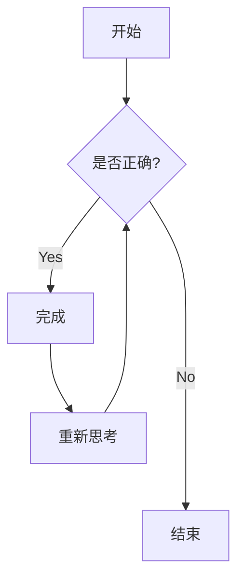

---
title: "Elements - coushudeblog"
date: 2008-08-08
category: "我嘞个豆"
year: "2000"
image: "images/blog/010/test.png"
tag: ["Markdown", "HTML", "Tailwind CSS", "首先我觉得", "最大的问题在哪里呢", "尤其是多看几次就会发现", "我个人觉得", "希望可以注意一个"]
draft: false
---

这里是标题示例。你可以根据以下 Markdown 规则使用这些标题。例如：使用 `#` 表示一级标题，使用 `######` 表示六级标题。

The recorded voice scratched in the speaker.
The sky was cloudless and of a deep dark blue.
The spectacle before us was indeed sublime.

人類社会のすべての構成員の固有の尊厳と平等で譲ることのできない権利とを承認することは、世界における自由、正義及び平和の基礎であるので、 人権の無視及び軽侮が、人類の良心を踏みにじった野蛮行為をもたらし、言論及び信仰の自由が受けられ、恐怖及び欠乏のない世界の到来が、一般の人々の最高の願望として宣言されたので……

## 二级标题

### 三级标题

#### 四级标题

---

## 文本强调 (Emphasis)

强调效果（即斜体），可以使用 *星号* 或 _下划线_。

加重强调（即加粗），可以使用 **星号** 或 **下划线**。

组合强调，可以使用 **星号与 _下划线_** 的混合方式。

删除线使用两个波浪号。~~这段文字已被划掉。~~

---

## 链接 (Link)

[我是一个行内样式链接](https://www.google.com)

[我是一个带有标题的行内链接](https://www.google.com "Google's Homepage")

[我是一个指向仓库文件的相对引用链接](../blob/master/LICENSE)

直接输入的 URL 或用尖括号包裹的 URL 将自动转换为链接。
<http://www.example.com> 或 http://www.example.com。在某些平台（如 Github）上，直接输入 example.com 也会生效。

---

## 正文段落 (Paragraph)

这是一段中文测试文字。排版的美感往往体现在长段落的视觉密度上。中文字符的方正结构与西文字母的流线型不同，因此在设置 `line-height`（行高）时通常需要比英文稍微大一些（建议在 1.6 到 1.8 之间）。这段文字存在的意义是为了帮助你检查段落的间距、首行缩进（如果有的话）以及文字对齐方式。无论是深色模式还是浅色模式，文字的对比度都应该是舒适的。在数字化阅读的时代，好的排版能让读者忽略排版本身，而直达思想的内核。

---

## 有序列表 (Ordered List)

1. 列表项目一：如果我是DJ你会爱我吗？
2. 列表项目二：你会爱我吗？你会爱我吗？
3. 列表项目三：让我们一起摇啊摇啊摇啊摇
4. 列表项目四：让这个世界从此不再有烦恼
5. 列表项目五：这是列表项目555555555555555555555

---

## 无序列表 (Unordered List)

- List item 001
- List item 002
- List item 003
- List item 004
- List item 005

---

## 复选框 (Checkbox)

- [x] **核心排版样式**：已完成 H1 到 H6 的字阶与边距校验
- [x] **语法高亮测试**：已支持常见编程语言的深色主题
- [ ] **移动端适配优化**：目前表格在小屏幕上的横向滚动仍有偏差
- [ ] **交互组件调试**：
  - [x] 标签页（Tabs）点击切换正常
  - [ ] 折叠面板（Accordion）的展开动画待优化
- [ ] **SEO 与性能**：图片的 `alt` 属性自动生成及 `WebP` 格式转换

---

## 系统提示框 (Notice)


这是一个普通的"备注"提示框。普通的DISCO我们普通的摇。



这是一个普通的"引用"提示框。普通的DISCO我们普通的摇。



这是一个普通的"技巧"提示框。普通的DISCO我们普通的摇。



这是一个普通的"信息"提示框。普通的DISCO我们普通的摇。



这是一条警告信息。
注意：这是一条警告信息。注意：这是一条警告信息。注意：这是一条警告信息。注意：这是一条警告信息。注意：这是一条警告信息。注意：这是一条警告信息。注意：这是一条警告信息。注意：这是一条警告信息。注意：这是一条警告信息。注意：这是一条警告信息。注意：这是一条警告信息。


---

## 代码与语法高亮 (Code)

这是一个 `Inline code` 示例。

```javascript
var s = "JavaScript 语法高亮测试";
alert(s);
```

```python
s = "Python 语法高亮测试"
print(s)
```

```c
#include <stdio.h>

int main(void)
{
    printf("hello, sucka\n");
    return 0;
}
```



---

## 引用块 (Blockquote)

> 优秀的排版应当像透明的玻璃。读者透过它直接看到思想，而不会被玻璃本身的纹理所干扰。在数字化阅读的洪流中，保持一份宁静的秩序感是每一位创作者的追求。

---

## 数据表格 (Tables)

| 标题列 | 这又是啥 | 这啥 |
| ------ | :------: | ---: |
| 第三列是 | 右对齐 | ¥1600 |
| 第二列是 | 居中对齐 | ¥12 |
| 我不跟不听 | Forest Swords 的 | 人说话 |

---

## YouTube 视频


