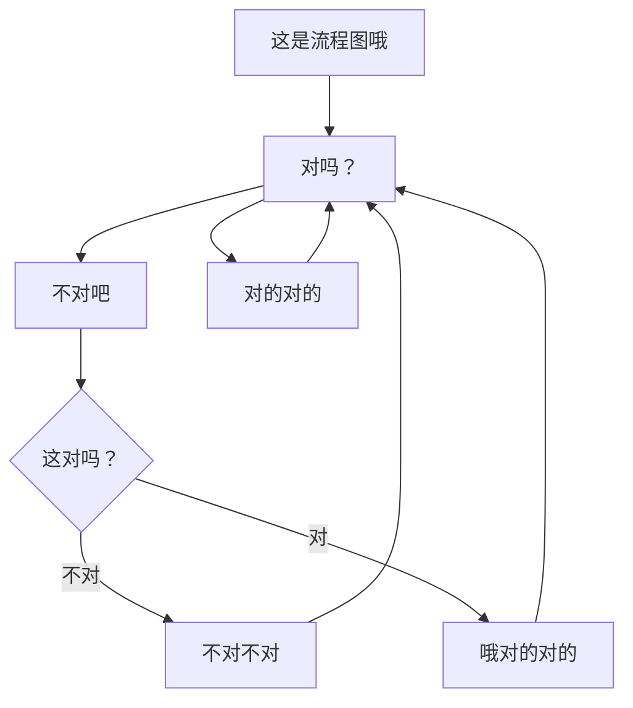

---
title: "开站第一天"
date: 2026-07-29
category: "碎碎念"
year: "2026"
tag: ["Markdown", "介绍", "开站大吉"]
---

> 本来只是想在 Notion 上随便写点 Blog 的，没想到事情会变成这样……

啊……是的，那什么，总之就是，如您所见——

欢迎来到我的个人主页！

您可以在 [Discography](/discography/) 找到我过往所有的音乐作品。如果您想了解我，从这里开始一定是个不错的选择。

[Blog](/blog/) 则是一个适合更深入了解我的地方。我打算在这里分享创作背后的故事和心得，当然少不了碎碎念环节。

[About](/about/) 里面有 About 页面都会有的东西。  

&nbsp;

Anyway，\[开站大吉金句一百条\]，\[开站大吉的祝福语精选五十篇\]！

[开站大吉 PNG 免抠图素材下载]

再见！

---

剩下的时间不如来看看~~不太~~精美的 Markdown 吧。

## 这是二级标题

### 这是三级标题

#### 这是四级标题，不是很喜欢用

&nbsp;

鼠标/手指放上来就能看到 Tooltip 哦

&nbsp;

1. 列表哦
2. 列表哦
3. 列表哦

&nbsp;

- 也是列表哦
- 也是列表哦
- 也是列表哦

&nbsp;

- [x] 记得买鸡腿肉
- [ ] 腌好冻起来
- [ ] 冻门永存

&nbsp;

| 这是表格哦 | 这是表格哦 | 这是表格哦 |
| ---- | :----: | ----: |
| 第三列是 | 右对齐的 | 鸡腿肉买真空包装的 |
| 第二列是 | 居中对齐的 | 黑胡椒还是咖喱 |
| 第一列是 | 左对齐的 | 冰箱快没地方了 |

&nbsp;




#### 不是说不喜欢用四级标题吗

请看左边的 Navigator。  
那里都不给四级标题留地方的，这难道不是很好笑吗？

（手机在上面啦）





写点不一样的东西以防您不知道标签页被切换了！




&nbsp;



- 文字是可以承载情感的
- 如您所见，文字感到有些害羞，它把自己折叠起来了
- 别看了！





/////// >_< ///////



&nbsp;



这是提示框哦。





注意了！这是提示框哦！



&nbsp;

```python
# 这是多行代码哦

print("Halo, waludo!")
print("Halo, waludo!")
print("Halo, waludo!")
```

对了，这是 `Inline code` 哦。

&nbsp;



&nbsp;



&nbsp;



&nbsp;

再见！
